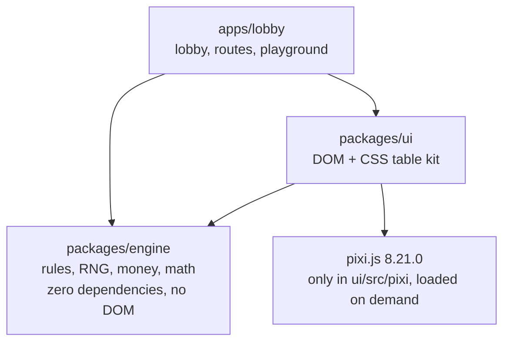

# Roll & Deal

A client-side demo lobby of four original casino table games. In each one **the player rolls two
dice and the dealer deals cards from a shoe**. It is a portfolio piece for game aggregators and
live-dealer studios. The priorities are code quality, a mobile-first table UX and math that anyone
can verify, ahead of feature count. There is no backend: everything runs in the browser with
virtual chips.

**Live demo:** <https://jonathascosta.github.io/CasinoGames/> ·
component playground: [`/dev.html`](https://jonathascosta.github.io/CasinoGames/dev.html)
(published from `main` by GitHub Actions, see [Deployment](#deployment))

## Status

All four games, **Dice Spread**, **Moving Target**, **Mirror** and **Lock & Roll**, are playable,
with their math proven exactly and by simulation. Lock & Roll is the one with a decision: the
player may lock a die and re-roll the other for the Lock fee.

| Area                                              | State                                                                                                                                                                                                                                                                                               |
| :------------------------------------------------ | :-------------------------------------------------------------------------------------------------------------------------------------------------------------------------------------------------------------------------------------------------------------------------------------------------- |
| [`packages/engine`](packages/engine/src/index.ts) | Done: RNG, dice, shoe, round state machine with decisions and fees, settlement, progressive jackpots, and the exact and Monte Carlo math tooling, all with tests                                                                                                                                    |
| [`packages/ui`](packages/ui/src/index.ts)         | Done: every table component, shown on the playground page                                                                                                                                                                                                                                           |
| [`apps/lobby`](apps/lobby/src/main.ts)            | Done: a lobby with a card per table (declared RTP, the live progressive meter, Play and Game sheet), house controls for the bankroll and the RTP stats, an RTP stats page for all four tables, and the tables on a shared table controller that also plays rounds waiting for the player's decision |
| CI/CD                                             | Done: lint, typecheck, unit tests, Monte Carlo suites, Node 20/24 matrix, the game sheets PDF, Lighthouse on every page, GitHub Pages deploy                                                                                                                                                        |
| The games                                         | [Dice Spread](docs/games/dice-spread.md), [Moving Target](docs/games/moving-target.md), [Mirror](docs/games/mirror.md) and [Lock & Roll](docs/games/lock-and-roll.md): playable, with game sheets, exact and Monte Carlo tests                                                                      |

| Game                                         | In one line                                          | Route            | State    |
| :------------------------------------------- | :--------------------------------------------------- | :--------------- | :------- |
| [Dice Spread](docs/games/dice-spread.md)     | Will the card land between your dice?                | `/dice-spread`   | Playable |
| [Moving Target](docs/games/moving-target.md) | Your dice set the target. Will the cards land on it? | `/moving-target` | Playable |
| [Mirror](docs/games/mirror.md)               | Your dice against the dealer's cards, hand for hand. | `/mirror`        | Playable |
| [Lock & Roll](docs/games/lock-and-roll.md)   | Lock a die, roll the other, beat the cards.          | `/lock-and-roll` | Playable |

## Quick start

You need Node 20.19+ or 22.13+ (22 LTS is recommended; `nvm use` reads [`.nvmrc`](.nvmrc)). You
also need pnpm, which Corepack provides at the version pinned in `package.json`.

```sh
corepack enable
pnpm install
pnpm dev   # lobby at http://localhost:5173, playground at http://localhost:5173/dev.html
```

| Command                                        | What it does                                                                                                                                    |
| :--------------------------------------------- | :---------------------------------------------------------------------------------------------------------------------------------------------- |
| `pnpm dev`                                     | Starts the Vite dev server for the lobby and the playground                                                                                     |
| `pnpm build`                                   | Builds everything: the engine into `packages/engine/dist`, the site into `apps/lobby/dist`                                                      |
| `pnpm preview`                                 | Serves the built site                                                                                                                           |
| `pnpm test`                                    | Runs unit and exact-math tests for the engine, the UI kit (in jsdom) and the lobby (about 10 s)                                                 |
| `pnpm test:math`                               | Runs the Monte Carlo suites: about 545 million seeded rounds (about 6 minutes)                                                                  |
| `pnpm lint` · `pnpm format` · `pnpm typecheck` | Run type-aware ESLint, Prettier, and `tsc` for every project                                                                                    |
| `pnpm docs:sheets`                             | Regenerates the paytables in `docs/games/*.md` from each game's `mathSummary()` (needs Node ≥ 22.18)                                            |
| `pnpm docs:check`                              | Fails when a game sheet or the game sheets PDF no longer matches the code (CI runs it)                                                          |
| `pnpm docs:pdf`                                | Prints `docs/GAME-SHEETS.pdf` from the four game sheets (needs Chrome or Chromium)                                                              |
| `pnpm lighthouse`                              | Runs Lighthouse, as a phone, on every page of the built site; fails any page under 90 for performance or accessibility (run after `pnpm build`) |
| `pnpm --filter @casinogames/engine smoke`      | Imports the built engine from plain Node and plays rounds with it (run after `pnpm build`)                                                      |

A Husky pre-commit hook runs `lint`, `format:check`, `typecheck` and `test`.

## Repository layout

```text
packages/
  engine/            Pure TypeScript game engine: zero dependencies, no DOM
    src/rng/           Rng interface, seeded xoshiro128**, crypto RNG, unbiased integers, shuffle
    src/dice/          rollDie, rollDice
    src/cards/         Cards, rank sets, Shoe (N decks, cut card, infinite mode), CardSource
    src/game/          Game and RoundState types, RoundBuilder, money, settlement, bet validation
    src/progressive/   In-memory progressive jackpot pool
    src/math/          Exact enumeration, BigInt fractions, Monte Carlo simulator, sheet renderer
    src/games/         The games (Dice Spread, Moving Target, Mirror, Lock & Roll) and the
                       GAMES registry
    src/testing/       Scripted RNG and cards, chi-square test (@casinogames/engine/testing)
    src/fixtures/      Two toy games that exercise the engine and its math tooling
  ui/                Table kit: DOM + CSS components with a PixiJS animation layer
    src/pixi/          The only place PixiJS is imported, loaded at a table's first interaction
    src/theme/         Design tokens and base styles
apps/
  lobby/             The site: lobby, RTP stats page, the tables on a shared controller
                     (src/tables), playground
docs/
  ARCHITECTURE.md    How the pieces fit together, and why
  MATH.md            RTP conventions and how every declared figure is verified
  games/             One sheet per game, with paytables generated from code
  GAME-SHEETS.pdf    The four sheets in one PDF, printed from them
  prompts/           The prompts that produced this repository, verbatim
scripts/             Repository tooling (the game-sheet generator)
tools/               Release tooling: the game sheets PDF and the Lighthouse check
.github/workflows/   CI and GitHub Pages deployment
```

## Architecture in brief



- **The engine decides every outcome and moves every cent. The UI only animates.** A round is a
  sequence of immutable `RoundState` snapshots. Each snapshot carries an ordered event log
  (`dice-rolled`, `card-dealt`, `decision-requested`, `bet-settled`…), which the UI replays with
  animations.
- **No `Math.random`, anywhere.** ESLint bans it. Every draw comes from an injected
  `Rng`, so rounds are reproducible from a seed and a certified RNG can replace the built-in ones.
- **The engine cannot reach the DOM.** It compiles against the bare ES2022 library with no ambient
  types, ESLint bans browser globals and UI imports inside it, and a test fails if it gains a
  runtime dependency.
- **PixiJS is confined to the animation layer, and loads last.** It may only be imported in
  `packages/ui/src/pixi` (lint-enforced). A table opens on CSS dice and DOM cards, loads PixiJS on
  the player's first tap or key press and moves to it at the next round, so no page downloads it
  to open, and the build fails if one ever could. Every Pixi view has a DOM fallback behind the
  same interface.
- **Published math comes from code.** Each game's paytable modal and game sheet are generated from
  its bet definitions. CI fails if a sheet drifts from the code.

[docs/ARCHITECTURE.md](docs/ARCHITECTURE.md) covers each package, the round lifecycle, the event
catalogue and the reasoning behind the main decisions.

### A game, in miniature

Rules are written against a small builder that enforces the invariants: integer stakes within
limits, every placed bet settled exactly once, and no changes after a step closes. This toy (not one
of the four games) is complete:

```ts
import {
  defineBets,
  diceTotal,
  odds,
  startRound,
  summarizeMath,
  type Game,
} from '@casinogames/engine';

const EVEN = odds(1);
const bets = defineBets([
  {
    id: 'over',
    label: 'Over 7',
    kind: 'main',
    min: 50,
    max: 10_000,
    rtp: 30 / 36,
    paytable: [{ id: 'eight-plus', label: 'Total 8–12', odds: EVEN, probability: 15 / 36 }],
  },
]);

export function createOverSeven(): Game {
  const game: Game = {
    id: 'over-seven',
    name: 'Over Seven',
    bets,
    start(placed, rng) {
      const round = startRound(game, placed, rng); // validates stakes, emits round-started
      const dice = round.rollDice(); // draws from the injected rng, emits dice-rolled
      if (diceTotal(dice) >= 8) round.win('over', EVEN, 'eight-plus');
      else round.lose('over'); // either way, emits bet-settled
      return round.finish(undefined); // checks every bet is settled, emits round-settled
    },
    decide() {
      throw new Error('No decisions in this game');
    },
    mathSummary: () => summarizeMath(game),
  };
  return game;
}
```

Two calls then check the declared RTP, exactly and by simulation:

```ts
import { createSeededRng, exactReturns, simulate } from '@casinogames/engine';

// Exact, over all 36 rolls: '5/6'
exactReturns(createOverSeven, { over: 100 }).bets.over!.rtp.toString();
// Seeded Monte Carlo: bets.over.rtp lands within ±0.15 pp of 5/6
simulate(createOverSeven(), { rounds: 5_000_000, rng: createSeededRng('mc'), bets: { over: 100 } });
```

## Moving the engine server-side

In this demo the engine runs in the browser. In production the operator's server must decide the
outcomes and hold the money, and the client only renders them. The engine is built so that this
move is a deployment change rather than a port: the same package runs behind an API, unmodified.

**Why the code moves as is**

- **Platform-free by construction.** `packages/engine` has no runtime dependencies. It compiles
  against `lib: ["ES2022"]` with `types: []`, so a reference to `window`, `document`, `Buffer` or
  `process` does not compile. ESLint also bans browser globals and UI or PixiJS imports inside it.
- **Proven on Node in CI.** `pnpm build` emits plain ES2022 modules with type declarations. CI
  imports that build from plain Node ([`smoke.mjs`](packages/engine/scripts/smoke.mjs)) on Node 20,
  22 and 24. Node ≥ 22.18 can also run the TypeScript sources directly, because they use only
  erasable syntax (`erasableSyntaxOnly`).
- **Randomness is injected.** Games draw only from the `Rng` handed to `start()`. A server
  plugs in its certified RNG by implementing `next()`. If its RNG service does its own certified
  range scaling, it implements `IntegerRng.nextInt(n)` instead. Integer draws use rejection
  sampling, so there is no modulo bias, and the shuffle's draw order is specified. Replaying the
  same RNG stream therefore reproduces a round exactly.
- **Integer money.** Stakes, payouts and balances are integer cents. The only rounding is explicit
  breakage on fractional odds, so settlement agrees with a ledger to the cent.
- **Rounds are values.** `start(bets, rng)` and `decide(state, choice)` move from one immutable
  `RoundState` to the next. Apart from its `rng`, a snapshot is plain data: current bets, the
  ordered event log, settlement lines, the options on offer and the game's private `data`.
- **Typed rejections.** Every invalid input throws an `EngineError` with a stable `code`
  (`STAKE_ABOVE_MAX`, `MAIN_BET_REQUIRED`, `INVALID_CHOICE`, `NOT_AWAITING_DECISION`…). An API
  maps each code to a 4xx response.

**What a server adds around it**

1. **Persistence.** Store each snapshot without its `rng` and resume a round with
   `game.decide({ ...stored, rng }, choice)`.
2. **Wallet.** Debit the stakes in `round-started` and every `stake-added`, debit every
   `fee-charged` (a fee a choice costs, never returned), and credit the `payout` of every
   `bet-settled`. `round-settled` carries the round totals for reconciliation.
3. **Audit trail.** Keep `events`: every roll, card, decision, stake and settlement, in order.
4. **Client projection.** Before sending a snapshot, drop `data` and blank the card in every
   face-down `card-dealt` until its `card-revealed`. The UI kit already works this way:
   `CardDealer.deal(null, hand, { faceUp: false })` deals a face-down card without its face, and
   `reveal()` paints the face once it arrives, so a hidden card never reaches the page.
5. **Table resources.** Games take cards through the `CardSource` interface, so a server can
   serve a persisted shoe and a live table can serve a card reader. `ProgressiveJackpot` is the
   reference for the pool arithmetic: `state()` is its exact state to keep, and
   `new ProgressiveJackpot(options, state)` carries on from it, as the demo does between visits.
6. **Math checks.** `exactReturns` and `simulate` run in the server's CI against the same code
   it deploys.

The UI components never decide anything. `DiceRoller` animates the dice the engine drew,
`CardDealer` deals the cards it is handed and `replayEvents` drives both from the event log. The
client therefore stays the same whether the engine runs locally or behind an API.

## Verifiable math

Every declared RTP is proven twice, against the real game code:

- **Exact.** `exactReturns` runs the game over every possible sequence of draws (dice and an
  infinite shoe) with exact BigInt fractions. The declared RTP must equal the enumerated fraction.
- **Monte Carlo.** A seeded simulation must land within ±0.15 percentage points of the declared
  RTP, dealt from the card source the declared figures assume. Each run has at least 2,000,000
  rounds. Volatile bets get more, sized from the bet's standard deviation so the tolerance is 3.29
  standard errors (99.9%). Where the real shoe returns slightly different figures, a second run
  measures the shift and the game sheet publishes it.

Dice Spread shows the standard on a real game. All 36 rolls × 6 card values give exactly the
declared fractions: 26/27 for Between, 11/12, 23/27, 5/6 and 31/36 for the side bets. A seeded run
of 124,852,059 rounds against the real six-deck shoe lands every bet within 0.043 pp. The
[game sheet](docs/games/dice-spread.md) also measures card counting exactly, and flags that
Between is countable at the default shoe penetration.

Moving Target deals several cards a round, which a finite shoe changes. A memoised recursion over
the dealer's running total reproduces its published table, equals the declared figures and equals
the real game run over all 71,469 roll and card sequences, fraction for fraction. A seeded run of
40 million rounds on an infinite shoe lands every bet within 0.01 pp. A second run, of 184 million
rounds on the real six-deck shoe, measures how far each house edge moves: +0.04 pp for Exact Hit,
+0.06 pp for First Card and −0.11 pp for 3+ Cards, all published in the
[game sheet](docs/games/moving-target.md) with Exact Hit's shift per target.
[docs/MATH.md](docs/MATH.md) covers the RTP conventions, the RNG, finite and infinite shoes,
round-count sizing and progressive jackpots.

Mirror has a progressive meter. Its published table is reproduced from 36 rolls × 24 × 24 cards
(one figure corrected: Equal Sums' edge is 8/81 = 9.88%, not 9.85%), and the game run over all
20,736 draws equals every declared fraction. Two cards a round and 54 rounds a shoe make every
round of the six-deck shoe a uniform draw from the full shoe, so its figures are exact too: the
pair bets lose about three points there. Double Sixes pays 1000 to 1 plus stake ÷ 25.00 of a meter
fed by 10% of its stakes; its declared 87.24% excludes the seed, and the sheet sets out the
meter's economics, including the seed's cost. Seeded runs of 125 million rounds on an infinite
shoe and 31 million on the real one confirm every figure, and measure the card counting exposure
per bet in the [game sheet](docs/games/mirror.md).

Lock & Roll has a decision. After the roll the player may Stand, or Lock: keep one die and
re-roll the other for the Lock fee, 40% of the bet (free on 1-1). The fee is never returned and
counts against the return. The best choice on each of the 21 rolls is computed by expected value,
never typed in, and a test derives it from scratch: it is the published strategy, and the house
edge follows exactly, 791/19440 = 4.07% with the free 1-1 and 161/3240 = 4.97% without. The game,
enumerated with that strategy deciding, returns the declared 18649/19440, and 148219/154440 on
every pair of cards a six-deck shoe can deal. Seeded runs of 5.1 million rounds on each shoe, with
the strategy bot deciding as autoplay does, confirm both, and the
[game sheet](docs/games/lock-and-roll.md) publishes the strategy card and the card counting
exposure.

## Performance and accessibility

Lighthouse (12, mobile: a mid-range phone on a slow 4G connection) scores every page of the site
at 98 or more for performance and 100 for accessibility. CI runs it on every push and fails any
page under 90 (`pnpm lighthouse`).

| Page                                            | Performance | Accessibility |
| :---------------------------------------------- | ----------: | ------------: |
| Lobby                                           |      99–100 |           100 |
| RTP stats                                       |         100 |           100 |
| Dice Spread, Moving Target, Mirror, Lock & Roll |      98–100 |           100 |

- **Tables open light.** A table first draws its dice and cards with CSS and loads PixiJS on the
  player's first tap or key press; the 3D dice and cards take over at the next round. Starting
  WebGL with the page blocked it for over a second on a phone without a fast GPU (the tables
  scored 56 to 64), and pulled 120 kB of PixiJS into the first load.
- **Keyboard.** Everything is operable from the keyboard: the chip rail with the arrow keys, a bet
  spot with Enter (Delete clears it), the dice with Enter or Space, Lock & Roll's choice (Tab to a
  die, Enter locks it, then Lock or Stand), autoplay, every dialog (focus moves in, and Escape
  brings it back). Controls that are unavailable during a round keep the focus, so the keyboard
  never falls back to the top of the page.
- **Reduced motion.** With the system setting on, the dice settle in place instead of flying,
  card movements last at most 160 ms, looping glows stop and shakes become flashes.
- **Names match what is on screen.** Each control's accessible name starts with its visible words,
  so speech control works, and axe-core's full rule set passes on every page.

## Quality gates

| Where               | What runs                                                                                                      |
| :------------------ | :------------------------------------------------------------------------------------------------------------- |
| Pre-commit (Husky)  | `lint`, `format:check`, `typecheck`, `test`                                                                    |
| CI: verify          | The same gates, then `docs:check` (the sheets and their PDF), `build`, and the engine smoke test on plain Node |
| CI: game sheets PDF | Prints `docs/GAME-SHEETS.pdf` afresh with the runner's Chrome, checks it and keeps it as an artifact           |
| CI: Lighthouse      | `pnpm lighthouse`: every page at 90 or more for performance and accessibility, as a phone                      |
| CI: math            | `test:math`, the Monte Carlo suites                                                                            |
| CI: Node matrix     | Unit tests, engine build and smoke test on Node 20 (the supported floor) and Node 24                           |
| Pages deploy        | Unit tests gate every deployment                                                                               |

TypeScript runs in its strictest practical configuration: `strict`, `noUncheckedIndexedAccess`,
`exactOptionalPropertyTypes` and `verbatimModuleSyntax`. ESLint uses `strictTypeChecked` plus the
architecture rules above.

## Deployment

[`pages.yml`](.github/workflows/pages.yml) builds the lobby and deploys it to GitHub Pages on every
push to `main`; it can also be run by hand. One-time setup: **Settings → Pages → Build and
deployment → Source: GitHub Actions**. The base path (`/CasinoGames/`) comes from
`actions/configure-pages`, so a custom domain needs no code change.

GitHub Pages only serves static files. For that reason the build writes a copy of `index.html` into
each game's folder and `stats/`, so deep links such as `/CasinoGames/mirror/` load directly. It also
writes a `404.html` that lets the client-side router handle any other path, and publishes
`docs/GAME-SHEETS.pdf` at the site's root, where the lobby links it.

## Toolchain decisions

- **TypeScript 6.0.** It is the newest line supported by `typescript-eslint`.
- **Vitest 4 and jsdom 29.** Newer majors require Node 22, and the project supports Node 20. CI
  tests both ends.
- **PixiJS pinned to 8.21.0 exactly.** It is the only runtime dependency. There is no UI framework:
  the chrome is DOM and CSS, built with a small `h()` helper.
- **No other runtime dependencies.** The Markdown renderer for rules sheets, the router, the sound
  (Web Audio synthesis, no audio files) and the statistics are written in the repository and
  tested.

## Documentation

- [docs/ARCHITECTURE.md](docs/ARCHITECTURE.md): packages, engine design, UI layering, data flow and
  decisions.
- [docs/MATH.md](docs/MATH.md): RTP conventions, verification method, progressive jackpots.
- [docs/games/](docs/games/): one sheet per game, which is also the in-game Rules dialog.
- [docs/GAME-SHEETS.pdf](docs/GAME-SHEETS.pdf): the four sheets in one PDF, to send.
- [docs/prompts/](docs/prompts/): the prompt history of this project.

## License

All rights reserved. No license is granted to use, copy or distribute this code
(`"license": "UNLICENSED"` in every `package.json`).
