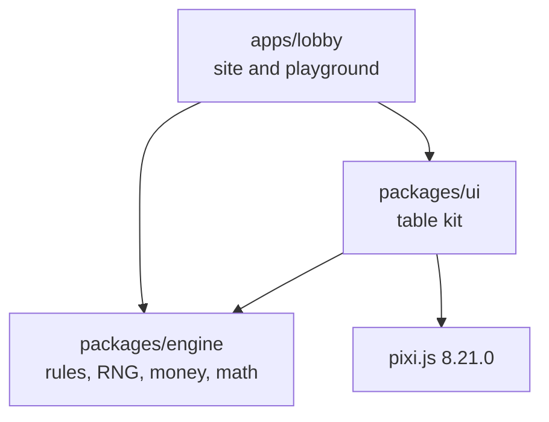
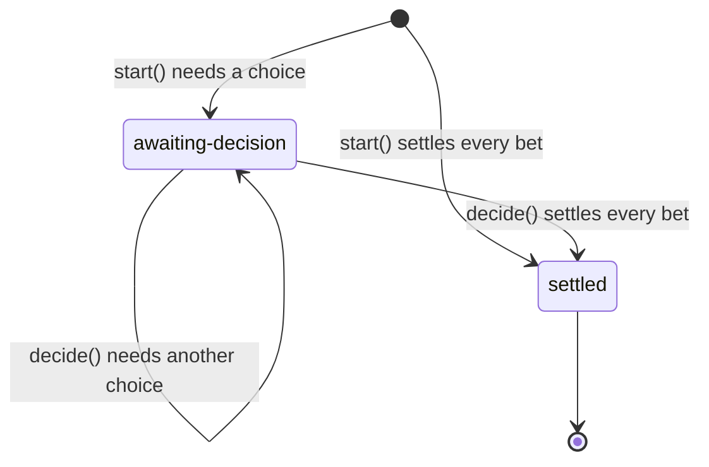
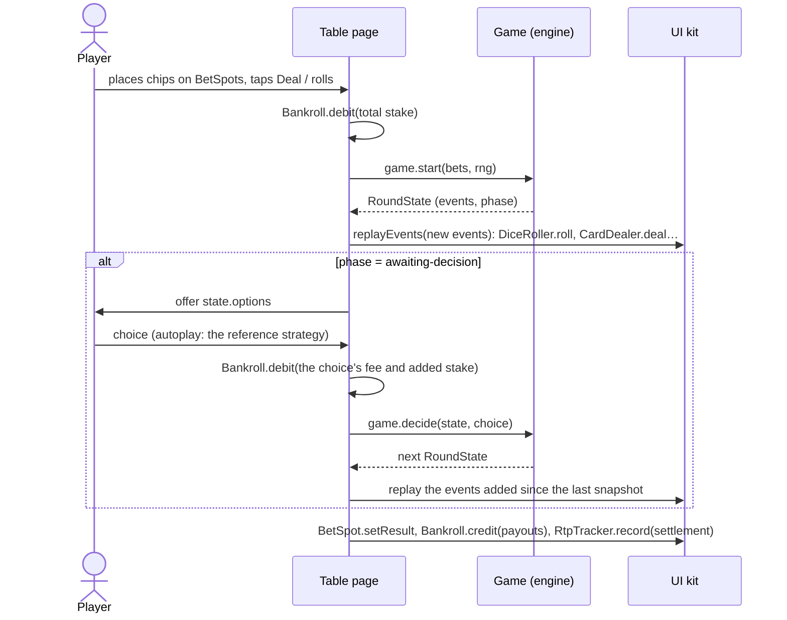

# Architecture

This document explains how the repository is put together and why. The [README](../README.md)
covers what the project is and how to run it. [MATH.md](MATH.md) covers how the numbers are
verified.

## Goals and constraints

- **Verifiable math first.** Every published RTP must be reproducible from code: exactly, where the
  game is enumerable, and by seeded simulation always.
- **Server-ready engine.** The browser demo has no backend, but the engine must run unmodified on
  a server where outcomes and money are authoritative.
- **Premium, mobile-first tables.** They must work from 360 px wide, in portrait and landscape, with
  touch, mouse, keyboard and screen readers, and honour reduced-motion preferences.
- **Few dependencies.** PixiJS (pinned) is the only runtime dependency, and it is confined to the
  dice and card animation layer. Everything else is DOM, CSS and TypeScript.

## Packages



| Package           | Role                                                                        | May import                           |
| :---------------- | :-------------------------------------------------------------------------- | :----------------------------------- |
| `packages/engine` | Decides outcomes and moves money: RNG, dice, shoe, rounds, settlement, math | Nothing: zero dependencies, no DOM   |
| `packages/ui`     | Table components (DOM + CSS) and the animation layer (PixiJS)               | engine, pixi.js (in `src/pixi` only) |
| `apps/lobby`      | The site: lobby, RTP stats, game routes, playground                         | engine, ui                           |

The dependency rules are enforced by tooling, not left to convention:

| Rule                                      | Enforced by                                                                                            |
| :---------------------------------------- | :----------------------------------------------------------------------------------------------------- |
| No `Math.random` anywhere                 | ESLint `no-restricted-properties` (`repo/no-math-random`)                                              |
| Engine has no runtime dependencies        | `src/package.test.ts` fails if `dependencies` appears in its `package.json`                            |
| Engine uses no DOM or Node APIs           | Build compiles with `lib: ["ES2022"]`, `types: []`; ESLint bans browser globals (`repo/engine-purity`) |
| Engine never imports UI or rendering code | ESLint `no-restricted-imports` (`repo/engine-purity`)                                                  |
| PixiJS only in `packages/ui/src/pixi`     | ESLint `no-restricted-imports` (`repo/pixi-confinement`)                                               |
| PixiJS never in a page's first load       | The lobby's build fails if any chunk the site loads, short of the PixiJS views, carries PixiJS         |
| The submission documents match the code   | `pnpm docs:check` in CI: no number typed by hand, every figure from `results.json`                     |

Workspace packages export their TypeScript sources (`"exports": "./src/index.ts"`), so Vite,
Vitest and `tsc` consume the source directly and there is no build-before-test step. The engine
also has a real build (`tsc -p tsconfig.build.json` → `dist/`, with declarations and source maps)
because a server would consume it as plain JavaScript. `publishConfig` points the exports at
`dist/`.

## Engine

### Module map

| Module         | Contents                                                                                                                     |
| :------------- | :--------------------------------------------------------------------------------------------------------------------------- |
| `rng/`         | `Rng`, `IntegerRng`, `createSeededRng`, `createCryptoRng`, `randomInt`, `shuffleInPlace`                                     |
| `dice/`        | `rollDie`, `rollDice`, `diceTotal`, `DieFace`, `DicePair`                                                                    |
| `cards/`       | `Card`, `Rank`, `Suit`, `RANK_SETS`, card codes (`'TH'`), `CardSource`, `Shoe`                                               |
| `game/`        | `Game`, `RoundState`, `GameEvent`, `BetDefinition`; `RoundBuilder`; money; settlement; validation; `playRound`               |
| `progressive/` | `ProgressiveJackpot`                                                                                                         |
| `math/`        | `Fraction`, `enumerateOutcomes`, `exactReturns`, `simulate`, `roundsForTolerance`                                            |
| `games/`       | The games (`dice-spread/`, `moving-target/`, `mirror/`, `lock-and-roll/`: rules, bets, the game) and `GAMES`, their registry |
| `testing/`     | Scripted RNGs and card sources, chi-square tests (`@casinogames/engine/testing`)                                             |
| `fixtures/`    | Three toy games (dice, war, re-roll) that exercise the engine and its math tooling in tests                                  |

### Randomness

Everything is deterministic given the injected `Rng`:

```ts
interface Rng {
  next(): number; // uniform in [0, 1), at least 32 bits of randomness
}
interface IntegerRng extends Rng {
  nextInt(n: number): number; // optional capability: uniform integer in [0, n)
}
```

- `createSeededRng(seed)` implements **xoshiro128\*\* 1.1**, with its 128-bit state expanded from
  the seed by SplitMix64 as its authors recommend. Seeds may be numbers, bigints or strings (FNV-1a
  64 over UTF-8), so tests read like `createSeededRng('war-fixture/monte-carlo')`. The port is
  checked against vectors produced by the reference C implementation. It is used for tests,
  simulations, replays and cosmetic variation.
- `createCryptoRng()` wraps `crypto.getRandomValues` (browsers, Node ≥ 20), fetched in blocks.
  Real play uses it.
- `randomInt(rng, n)` scales to an integer by **rejection sampling** on 32 bits: values in the
  incomplete top bucket are redrawn, so each result has probability exactly 1/n. When the `Rng`
  implements `nextInt`, `randomInt` delegates to it. That is how the exact enumerator branches on
  every draw, and how a server can plug in an RNG service that does its own certified scaling.
- `shuffleInPlace` is Fisher–Yates (Durstenfeld), drawing from the last index down. **The draw
  order is part of the determinism contract**: the same stream always produces the same shoe.

Cosmetic randomness (the tumble axes of the 3D dice, pitch variations in the synthesised sounds)
also goes through seeded `Rng`s, in separate streams that never touch outcomes. That keeps the
`Math.random` ban absolute.

### Cards and the shoe

Games take cards through `CardSource`, not through `Shoe` directly:

```ts
interface CardSource {
  beginRound(rng: Rng): boolean; // reshuffles if due; true if it did
  draw(rng: Rng): Card;
  remaining(): number; // Infinity for an infinite shoe
  size(): number;
  shuffleCount(): number;
}
```

This seam lets tests script exact cards (`createScriptedCardSource('AS TH 5D')`), lets a server
serve a persisted shoe, and lets a live-dealer table serve a card reader.

`Shoe` behaves like a dealing shoe:

- It holds N decks of a configurable rank set (`RANK_SETS.aceToSix`, `aceToTen`, `aceToKing` or
  any list) in four suits.
- The **cut card** sits at `penetration` (default 0.75, meaning 25% of the cards remain). It never
  interrupts a round: once it is out, the round finishes and the next `beginRound()` reshuffles
  everything.
- If a round empties the shoe, only the discards from earlier rounds are shuffled into a new stack,
  never the cards in play, and a full reshuffle is forced before the next round. A round that needs
  more cards than the whole shoe throws `ShoeExhaustedError`.
- **Infinite mode** (`decks: Infinity`) draws each card independently and uniformly from one deck's
  composition, with exactly one RNG draw per card. Exact enumeration and Monte Carlo tests use it.

`RoundBuilder.dealCard` records a `shoe-shuffled` event whenever a draw triggers a mid-round
reshuffle, so the UI can play the shuffle animation at the right moment.

### Money and settlement

- **All money is integer cents** (`Cents`, a safe integer). Bets are `{ [betId]: cents }`.
- Odds use "to" notation: `odds(3, 2)` is "3 to 2". A winning stake returns the stake plus
  `floor(stake × to / per)`, and the fraction of a cent (breakage) stays with the house.
- A `SettlementLine` is `{ stake, payout, fee?, net, outcome, entryId? }`. `payout` is everything
  handed back, stake included: 0 on a loss, the stake on a push. `fee` is what choices cost during
  the round (Lock & Roll's Lock fee), never returned; `net` is payout − stake − fee. The outcome
  is derived from `net`, so a surrender that returns half the stake is a loss. RTP is
  Σ (payout − fee) ÷ Σ stake: a fee is not a stake, it lowers the return.

### Bets

A `BetDefinition` carries everything the UI, docs and simulations need: `id`, `label`, `kind`
(`main` or `side`), limits in cents, a paytable of fixed-odds, progressive or push entries (each
with an optional exact `probability`), the declared `rtp` and an optional `standardDeviation`. From
the paytable, `summarizeMath` derives each bet's hit frequency, push frequency and max exposure.

When a payout depends on something the round settles before the result, such as Moving Target's
target, each line names that condition in `given`: its name, its value and the chance of that
value. The summary then adds a `breakdown` with one row per value: its chance, and the hit
frequency, RTP and house edge given it. The paytable dialog shows that table in place of the flat
paytable, and the Math Report gives it by target.

A bet with a progressive meter declares its terms in `progressive`: the meter, its seed, the share
of every stake that feeds it, the stake that wins the whole meter (a smaller stake wins its share),
the chance of the hit and the RTP of the fixed pays. Its line pays fixed odds plus the meter
(`odds` with a `jackpot` whose `fullShareStake` scales it with the stake). The declared RTP is the
fixed pays' plus the contribution rate, the return excluding the seed, since the meter pays out
every contribution in the long run. The summary derives the meter's economics from the terms (RTP
at the seed, break-even meter, cycle, seed cost, exposure), and `progressiveRtpAtMeter` gives one
round's RTP at any meter.

A game with decisions declares them in its summary (`decisions`): its reference strategy as a
card, the value of every choice in each situation and the best one, and what the strategy returns
under the table's rules and under variants of them (RTP, house edge, element of risk, how often
each choice is made, the fees). The declared figures assume that strategy.

A bet may also declare `finiteShoe`: its exact figures on the table's own shoe. They exist when a
game deals the same number of cards every round, as Mirror does, so that every round's cards are
a uniform draw from the full shoe; the Math Reports publish them beside the declared figures.

- `defineBets([...])` validates definitions **at module load** (unique ids, sane limits, plausible
  RTP, non-empty paytables, consistent conditions and progressive terms), so a misconfigured
  paytable fails on import, in
  the first test run or at startup, rather than mid-round.
- `validateBets(definitions, bets)` runs at the start of every round. Every id must be known, stakes
  must be integer cents within limits, at least one bet must be placed, and side bets require a main
  bet. Zero stakes are dropped. Each failure is an `EngineError` with a stable code.

### Rounds

A game is a state machine over rounds:

```ts
interface Game<TChoice, TData, TEvent> {
  readonly id: string;
  readonly name: string;
  readonly bets: readonly BetDefinition[];
  start(bets: Bets, rng: Rng): RoundState<TChoice, TData, TEvent>;
  decide(
    state: RoundState<TChoice, TData, TEvent>,
    choice: TChoice,
  ): RoundState<TChoice, TData, TEvent>;
  mathSummary(): MathSummary;
}
```



A `RoundState` is an immutable snapshot:

| Field        | Meaning                                                                                        |
| :----------- | :--------------------------------------------------------------------------------------------- |
| `phase`      | `'awaiting-decision'` or `'settled'`                                                           |
| `bets`       | Current stakes, including stakes added by decisions                                            |
| `fees`       | Fees charged per bet so far by the choices made                                                |
| `events`     | The ordered event log since `round-started`                                                    |
| `settlement` | Lines for the bets settled so far; complete once `phase` is `'settled'`                        |
| `options`    | The choices `decide()` accepts (empty once settled), each with an optional added stake and fee |
| `data`       | Game-private continuation state: hidden cards, kept dice…                                      |
| `rng`        | The round's `Rng`, carried so `decide()` keeps drawing from the same stream                    |

Games are written against `RoundBuilder`, obtained from `startRound(game, bets, rng)` or
`continueRound(state, choice)`. The builder owns the invariants, so no game can break them:

- Stakes are validated before anything is drawn. Every placed bet is settled **exactly once**, and
  `finish()` refuses to close a round with unsettled bets (`UNSETTLED_BETS`).
- Settling an unplaced bet, settling twice, or adding stake to a settled bet all throw.
- Choosing an option applies its `additionalStake` (a raise, a double) as a `stake-added` event,
  then charges its `fee` (a re-roll) as a `fee-charged` event. A fee is charged against a placed,
  unsettled bet, and the bet's settlement line carries it.
- A closed step cannot be modified (`ROUND_CLOSED`). Each `decide()` returns a new snapshot, and
  earlier snapshots are never mutated.
- Lifecycle events (`round-started`, `decision-*`, `stake-added`, `fee-charged`, `bet-settled`,
  `round-settled`) can only be emitted by the builder. Games emit the rest (`dice-rolled`,
  `card-dealt`, their own custom events) through `emit()` or the `rollDice()` / `dealCard()`
  helpers.

### Event catalogue

| Event                | Payload                                                    | Emitted by                                          |
| :------------------- | :--------------------------------------------------------- | :-------------------------------------------------- |
| `round-started`      | `bets` (validated stakes)                                  | builder                                             |
| `shoe-shuffled`      | `cards` in the new stack                                   | `prepareCards`, `dealCard`                          |
| `dice-rolled`        | `dice: [d1, d2]`                                           | `rollDice`                                          |
| `card-dealt`         | `card`, `to` (hand id), `faceUp`                           | `dealCard`                                          |
| `card-revealed`      | `card`, `to`, `index` within the hand                      | `revealCard`                                        |
| `decision-requested` | `options`                                                  | builder (`awaitDecision`)                           |
| `decision-made`      | `choice`                                                   | builder (`continueRound`)                           |
| `stake-added`        | `betId`, `amount`                                          | builder (`addStake`)                                |
| `fee-charged`        | `betId`, `amount`                                          | builder (`chargeFee`)                               |
| `jackpot-won`        | `jackpotId`, `betId`, `amount`                             | game                                                |
| `bet-settled`        | `betId` and the settlement line                            | builder (`win`, `lose`, `push`, `payout`, `settle`) |
| `round-settled`      | `totalStake`, `totalPayout`, `totalFees` (when any), `net` | builder (`finish`)                                  |

Games may add custom events (a moving marker, a locked die) through the `TEvent` type parameter.
Their `type` must not clash with the core events.

`card-dealt` carries face-down cards, because the engine needs them to settle. When the engine runs
on a server, the client receives a projection with those cards blanked until the matching
`card-revealed` (see [Server-side](#server-side)).

### Tables and rounds

A `Game` object is created **per table** and may own table resources: a finite shoe that persists
across rounds, or a progressive pool. Rounds themselves are values. This split keeps the round
logic pure and makes the stateful parts explicit and replaceable. The exact enumerator creates a
fresh game for every branch so table state cannot leak between branches. The simulator reuses one
game for millions of rounds, so a leak between rounds would surface there.

### Progressive jackpots

`ProgressiveJackpot` is an in-memory pool with a seed amount, a contribution rate and an optional
cap. Contributions are tracked in millionths of a cent, so sub-cent amounts accumulate exactly
instead of being rounded away, and the running totals are kept as whole cents plus millionths, so
they stay exact over hundreds of millions of stakes. An award pays a share of the pool in whole
cents: a fixed share, or an exact fraction (`awardFraction(stake, fullShareStake)`, computed with
BigInt) for a meter paid in proportion to the stake. The house tops the pool back up to its seed.
The pool conserves money exactly: seed + contributions + top-ups = awards + pool, and tests check
it. `state()` is the pool's exact state, and `new ProgressiveJackpot(options, state)` carries on
from it (a stored pool below the seed is topped up to it). The long-run RTP of a progressive bet is
derived in [MATH.md](MATH.md#progressive-jackpots).

### Math tooling and the submission documents

`exactReturns` (exhaustive enumeration with BigInt fractions) and `simulate` (Monte Carlo with
standard errors) both run the real game through `playRound`, so they test the implementation, not
a model of it. `simulate` can hand every settled round to an observer, for statistics the report
does not keep, such as Moving Target's figures per target, and can take stakes chosen per round.
[MATH.md](MATH.md) describes both.

Every game's `mathSummary()` is derived from its bet definitions by `summarizeMath`, and the
paytable modal renders it in the browser. The exact and Monte Carlo suites record what they
compute as file snapshots beside the tests (`packages/engine/src/games/<id>/results/*.json`,
through `testing/record.ts`), with the test's file and name: a run that computes anything else
fails, and `-u` rewrites them.

`tools/generate-docs.ts` (`pnpm docs:generate`) writes the submission documents from those two
sources only: `docs/results.json` gathers the math summaries, the records and the table facts
the Rules of Play read from the engine; the Rules of Play (`docs/rules/<id>.md`) and the Math
Reports (`docs/math/<id>.md`) are written from it; and `docs/SUBMISSION-PACK.pdf` puts them behind
a cover. The templates (`tools/docs/`) cannot hold a digit: every number enters as a figure of
`results.json`, marked with its path and formatter, and the generator re-checks each against
`results.json` before writing, failing on any stray number. The Math Reports name the last commit
that changed the engine, so documents are regenerated in a commit after the engine's. The
generated files are kept from Prettier, and `pnpm docs:check`, in CI, fails when any of them
differs from what the code gives. [docs/README.md](README.md) describes both documents.

The PDF goes through the kit's own Markdown renderer on a jsdom document, so it reads like the
Rules dialog, and headless Chrome prints it. Its title carries a hash of the documents, the
generator and the renderer: `docs:check` compares it without a browser or a PDF parser, and CI
also prints the PDF afresh and keeps it as an artifact. The site publishes it at its root. The
scripts in `tools/` are type-checked with their own `tsconfig.json` (DOM and Node types together).

### A game: Dice Spread

`games/dice-spread` shows how a game is built on the engine:

- `rules.ts` is the rulebook as pure functions of a roll and a card value
  (`resolveDiceSpreadBet`, `readDiceSpreadRoll`). The game settles with them and the table reads
  the roll with them, so the rules exist once.
- `bets.ts` declares every bet with exact fractions: RTP, entry probabilities and σ.
- `game.ts` owns the table's six-deck shoe and plays a round: roll, deal face down, reveal, settle.
- The tests enumerate all 36 rolls × 6 card values exactly, simulate 124,852,059 rounds against
  the real shoe, and compute the card counting exposure exactly.

### A game: Moving Target

`games/moving-target` follows the same shape, with a variable number of cards per round:

- `rules.ts` settles a bet on a target and the card values dealt, and reads each bet's outlook
  while the cards land (`movingTargetOutlook`: live, won or lost), which the table uses to mark the
  side bets as soon as the cards decide them.
- `bets.ts` declares the math for an infinite shoe. Exact Hit's lines name their target
  (`given`), so its summary breaks down by target; its figures are exact fractions from the closed
  form of the chance to land on a total.
- `game.ts` rolls the target, then deals face up from its six-deck shoe of aces to tens until the
  total reaches the target (at most 12 cards), and settles.
- The tests reproduce the published table with a memoised recursion, check it against the declared
  figures and against the game run over all 71,469 roll and card sequences, and measure how the
  six-deck shoe shifts every edge: exactly for the first round after a shuffle, and over the long
  run by simulation.

### A game: Mirror

`games/mirror` adds a progressive meter and exact six-deck figures:

- `config.ts` holds everything that can be retuned without touching the rules: the shoe, the
  limits, the payouts and the meter (seed, contribution rate, the stake that wins it all).
- `rules.ts` reads a hand the same way for the dice and the cards (`readHand`: "PAIR 4s", "SUM 9
  HIGH 6"), compares hands, settles each bet and gives each bet's outlook while the cards come.
- `bets.ts` computes the declared math as exact fractions from the configuration, on an infinite
  shoe and on the six-deck shoe.
- `game.ts` owns the six-deck shoe and the meter: a Double Sixes stake feeds the meter as the bet is
  accepted, and a hit pays its share of it. Its `jackpot-meter` events carry the meter's value for
  the table to show.
- The tests reproduce the published table from 36 × 24 × 24 draws, run the game over them and over
  every pair of cards a full six-deck shoe can deal, check the meter's pay and accounts, simulate
  both shoes and measure the card counting exposure.

### A game: Lock & Roll

`games/lock-and-roll` is the game with a decision, in the engine's `awaiting-decision` phase:

- `config.ts` holds the shoe, the limits, the payout and the re-roll's rules: the Lock fee (40%
  of the bet, rounded up to the cent) and the free 1-1.
- `rules.ts` names the choices (`stand`, `lock-0`, `lock-1`: stand, or lock that die and
  re-roll the other), prices them and compares the totals. It also marks the extension point for
  _Lock & Double_ (re-roll and double the bet), which this version does not offer.
- `strategy.ts` values every choice on every roll exactly, for any rules and any dealer card
  source, and computes the best one: the reference strategy is derived, never typed in.
  `strategyMath` gives what a strategy returns, fees included.
- `bets.ts` declares the bet and the strategy card from those computations, with the rules priced
  with and without the free 1-1 and on the six-deck shoe.
- `game.ts`: `start()` rolls and awaits the decision, offering Stand, and Lock on either die with
  the Lock fee; `decide()` charges the fee, re-rolls the unlocked die (`die-rerolled`), deals two
  cards face up and settles. `lockAndRollStrategy()` is the reference strategy as a player, which
  autoplay, the simulations and the exact tests all use.
- The tests derive the best choice on each of the 21 rolls from scratch by expected value and check
  it against the published strategy, enumerate the game with that strategy on an infinite shoe
  and on every pair of cards from a full six-deck shoe, simulate both shoes with the bot deciding,
  and measure the card counting exposure.

## UI kit

### Two layers

- **Chrome is DOM + CSS**: chips, bet spots, balance, toggles, modals, the RTP panel and autoplay.
  These parts need accessibility, text rendering, layout and focus management, which the DOM
  already does well.
- **Animation is PixiJS**, only for the 3D dice and the card table. Each is defined by a small view
  interface (`DiceView`, `CardView`) with two implementations: a PixiJS one, loaded with a dynamic
  `import()`, and a DOM/CSS fallback. If WebGL and Canvas both fail, or `renderer: 'dom'` is
  requested (tests, very old devices), the component quietly uses the fallback.
- **PixiJS loads last.** The tables use the `'deferred'` renderer: `DiceRoller` and `CardDealer`
  open on their DOM views, and `enhance()`, which a table calls on the player's first pointer or
  key press anywhere on the page, loads the PixiJS view out of sight (`visibility: hidden`). The
  dice take over at the next throw of both dice, from the faces showing; the cards the next time
  the table is cleared, with the shoe display carried over. Both moments open a round, so the
  change passes with it. Starting PixiJS with the page cost the tables 35 to 45 points of
  Lighthouse's mobile performance: WebGL's start-up queries wait on the GPU process, and where it
  paints in software (Lighthouse's lab, phones without a fast GPU) it was still rasterising the
  page, blocking the main thread for over a second. `'auto'` (the playground) still starts on
  PixiJS.
- Pixi hosts **render on demand**: the ticker does not run continuously. A frame is drawn only
  while an animation is in progress or after a resize, which keeps idle tables at zero GPU cost on
  phones.

Components never decide outcomes. `DiceRoller` reports how hard the player threw, and the table
then draws the result from the engine and hands it back to animate. `CardDealer` deals the cards
it is given. A face-down card is drawn as a back only, and its face is painted when it is revealed,
so a hidden card is never put on the page.

### Components

| Component               | Purpose                                                                                                                                                                                                                                                    |
| :---------------------- | :--------------------------------------------------------------------------------------------------------------------------------------------------------------------------------------------------------------------------------------------------------- |
| `ChipRail`              | Chip selector (0.50 / 1 / 5 / 25 / 100): a radio group with roving focus that steps down when the balance cannot cover the chip                                                                                                                            |
| `BetSpot`               | Tap to add the selected chip, long-press (with a progress ring), right-click or Delete to clear; shows rejections and results                                                                                                                              |
| `DiceRoller`            | Tap, or hold and release to throw harder; 3D tumble with bounces in Pixi, CSS dice until PixiJS takes over (`enhance()`) or as the fallback. Can lay a button over each die (Lock & Roll's lock, with a padlock) and re-roll one die while the other stays |
| `CardDealer`            | Deals from a shoe with slide and flip, shows the shoe counter and the cut card, announces cards to screen readers; DOM cards laid out like the PixiJS ones until those take over                                                                           |
| `BankrollDisplay`       | Balance with a count-up and a floating win or loss delta; offers a top-up below the table minimum                                                                                                                                                          |
| Paytable modal          | Built from `mathSummary()`: odds, probabilities, RTP, house edge, standard deviation, limits, and a game's strategy card                                                                                                                                   |
| Info modal              | Renders Markdown in a dialog: the table's Rules and the lobby's Rules of Play                                                                                                                                                                              |
| `RtpPanel`              | Rounds, wagered, returned (and fees), and live versus declared RTP per bet, fees counted against the return, with a convergence sparkline and its 95% band; a progressive bet's RTP at the current meter, and the figures on the table's shoe              |
| `AutoPlay`              | Runs 10 to 100 rounds; stops on request, on error, or before a round the balance cannot cover                                                                                                                                                              |
| Turbo and sound toggles | Switches that persist settings; turbo sets the motion level to `none`                                                                                                                                                                                      |
| `ProgressiveMeter`      | A progressive meter that counts up as stakes feed it and flashes when a hit pays from it                                                                                                                                                                   |

### Motion

One `Motion` policy serves the whole page, with three levels: `full`; `reduced` (the OS asks for
it, so large movements become short fades, capped at 160 ms); and `none` (turbo: results appear
instantly). Components ask the policy for durations instead of hard-coding them. CSS reads the same
policy through duration tokens that collapse to zero under `[data-motion='turbo']` and
`prefers-reduced-motion`. The few animations with their own timing follow the media query
themselves: the loops (the dice tray's hint, the offered dice, Dice Spread's winning values) stop,
the refused bet flashes instead of shaking, the balance's change fades in place, and held dice do
not rattle.

### Sound

Every sound is synthesised with the Web Audio API: filtered noise for chips, dice and cards, and
short triangle-wave arpeggios for wins. No audio files are shipped. Browsers block audio until a
user gesture, so the `AudioContext` is created on the first gesture and never before. Calls made
before that are silent no-ops, which also keeps page load free of autoplay warnings.

### State and persistence

- A tiny `createStore(initial, equals)` provides subscribable state with no framework.
- `createSafeStorage()` wraps `localStorage` in try/catch (private mode, quotas, disabled storage)
  and falls back to memory. It validates everything it reads, because stored data is untrusted.
- Only four things persist, under the `casinogames:v2:` namespace: the **bankroll**, the
  **settings** (turbo, sound), the **RTP stats** per game (`rtp:<gameId>`, saved on a 400 ms
  debounce) and the **progressive meters** (`jackpot:<id>`, the pool's exact state, saved after
  every round). The convergence history is sampled at geometrically spaced round counts, so a
  million rounds of one bet take about 3 kB.
- `SafeStorage.watch(key, listener)` reports changes made by other tabs (the `storage` event), so
  the lobby's meter and the RTP stats page follow rounds played at a table in another tab.
- The namespace carries the storage schema version. When stored data changes meaning, as when the
  games and bets took their English ids in v2, the version is bumped and `discardStaleVersions()`
  removes every key of the other versions at start-up. Nothing is migrated: the bankroll, stats
  and meters simply start again.

### Accessibility

- Tap targets are at least 44 px. Every control is reachable and operable from the keyboard.
- Components use native elements and standard ARIA roles: `<dialog>` for modals, `radiogroup` for
  the chip rail, `switch` for the toggles.
- Dealt cards, thrown dice and autoplay stops are announced through `aria-live` regions.
- The router moves focus to each new page's heading and updates the document title.
- Controls that are unavailable during a round (Roll, Clear, Autoplay) are `aria-disabled`, not
  `disabled`: a disabled button loses the keyboard focus, which would fall back to the top of the
  page every round. What closes under the focus hands it back: the autoplay menu to its toggle,
  Lock & Roll's choice to the dice.
- Accessible names start with the words on screen (WCAG 2.5.3, for speech control). The dice tray
  is named after its hint ("Tap or hold to roll the dice"); a bet spot's name reads its label and
  caption, then its stake and result, which the stylesheet draws, like the values on the chips.
- Reduced motion is honoured everywhere (see [Motion](#motion)).
- Lighthouse scores every page 100 for accessibility, and axe-core's full rule set passes.

### Theme

Design tokens are CSS custom properties in `packages/ui/src/theme/tokens.css`: felt, brass, ink,
signal colours, chip and card colours, type, spacing, radii, shadows and durations. Pixi views read
their colours from the same tokens at runtime, so the canvas matches the chrome.

## Lobby app

- **Routing.** A small History API router with base-path support (`/CasinoGames/` on Pages)
  intercepts in-app links, moves focus, sets titles and loads pages lazily. Table pages and PixiJS
  load on demand: the lobby itself downloads about 36 kB of JavaScript (15 kB compressed) and
  neither of them.
- **Routes.** `/` is the lobby, `/stats` the RTP stats page, and `/:slug` serves one of the four
  game slugs (anything else gets the not-found page). Games with rules load their table from the
  `tables/` registry; the others show a placeholder page. Each table's Rules dialog shows the players' part of its Rules of Play
  (`docs/rules/<slug>.md`, from the objective to the settlement), loaded through
  `import.meta.glob` so the generated documents are the single source.
- **Tables.** What every table shares lives in `tables/`: `DiceTable` runs the chips, balance,
  actions, autoplay, bet spots and a round's life (stakes debited on the roll, the engine's events
  replayed step by step, a choice's fee debited when it is made, payouts credited at settlement,
  even when the page closes mid-round, when a round awaiting a decision ends with the choice that
  costs nothing); `table-page.ts` builds the page around it (rules, paytable, RTP monitor);
  `table.css` styles the table surface, the felt and the controls. A game brings its view, its felt
  layout and the replay of its own events: Dice Spread its 1–6 strip, Moving Target its target
  board, Mirror its mirror (the cards above, the dice below, the glass tilting toward the winner)
  and its meter, Lock & Roll its decision (the dice as lock buttons, Stand and "Lock · +0.40", a
  strategy hint marked as a demo feature, autoplay deciding with the reference strategy) and the
  two totals side by side. A table with a meter hands it to the RTP monitor, and the lobby shows
  the stored meter on the table's card.
- **Lobby.** A card per table: its art, the main bet's declared RTP, the tagline, the live
  progressive meter where it has one, and two actions, Play (a link stretched over the card) and
  Rules of Play (the whole document in a dialog, loaded on first use, with a link to the submission
  pack).
- **House controls.** The lobby's bar shows the bankroll with a reset, and links the RTP stats with
  a reset for every table's figures; both resets ask first, in a dialog that opens on Cancel.
- **RTP stats.** `/stats` adds up the stored stats of all four tables (rounds, wagered, returned,
  fees, observed against the stake-weighted declared RTP, table by table) and shows each table's
  RTP monitor, following rounds played in another tab.
- **Static hosting.** At build time small Vite plugins copy `index.html` into each game's folder,
  `stats/` and `404.html`, so deep links load directly on GitHub Pages; publish
  `docs/SUBMISSION-PACK.pdf` at the site's root; and fail the build if PixiJS could reach a page's
  first load (`pixiOnDemandOnly`, which caught the bundler placing its own helpers in a PixiJS
  chunk that every table then loaded).
- **Services.** `createServices()` builds the page-wide state once (storage, settings, bankroll,
  sound) and hands it to every page.
- **Playground.** `apps/lobby/dev.html` shows every component in isolation, including 3D dice,
  dealing from a real 6-deck engine shoe with the crypto RNG, and an RTP panel that can be fed up
  to 250,000 simulated rounds at a click.

## How a table plays a round

Every table follows this flow through the shared `DiceTable` (`apps/lobby/src/tables`), which
also carries a game's own events (Mirror's `jackpot-meter`) to its replay.



## Server-side

The engine is ready to move behind an API unchanged. The client keeps the flow above and swaps the
local `game.start` / `game.decide` calls for requests. What the server adds (persistence without
the `rng`, wallet movements from the event log, redaction of face-down cards, persistent table
resources) is listed in the [README](../README.md#moving-the-engine-server-side).

## Testing strategy

| Layer        | What is tested                                                                                                                                                                                                                                                                                                                                                                                                                                                   | How                                                   |
| :----------- | :--------------------------------------------------------------------------------------------------------------------------------------------------------------------------------------------------------------------------------------------------------------------------------------------------------------------------------------------------------------------------------------------------------------------------------------------------------------- | :---------------------------------------------------- |
| RNG          | Reference vectors (xoshiro128\*\* and SplitMix64), reproducibility, seed handling, uniformity of `randomInt`, shuffles and dice                                                                                                                                                                                                                                                                                                                                  | Vitest; seeded chi-square tests, so they cannot flake |
| Shoe         | Composition, penetration and cut card, reshuffle rules, mid-round exhaustion, infinite mode                                                                                                                                                                                                                                                                                                                                                                      | Vitest with seeded and scripted RNGs                  |
| Rounds       | Builder invariants, validation, error codes, settlement arithmetic, decisions, added stakes and fees                                                                                                                                                                                                                                                                                                                                                             | Vitest with scripted dice and cards                   |
| Math tooling | Enumeration (including non-determinism detection), fractions, simulator statistics, recorded figures                                                                                                                                                                                                                                                                                                                                                             | Vitest                                                |
| Game math    | Exact RTP, probabilities and variance equal the declared fractions (for Moving Target, via a memoised recursion too; for Mirror and Lock & Roll, on the six-deck shoe as well); Lock & Roll's strategy derived by expected value; a progressive meter's pay and accounts; Monte Carlo within ±0.15 pp; the six-deck shoe's shift; card counting exposure                                                                                                         | `pnpm test` (exact), `pnpm test:math` (Monte Carlo)   |
| UI kit       | Components' DOM, keyboard and pointer behaviour, persistence, motion, audio gating, autoplay stops, RTP statistics; the deferred renderers taking over (with stand-in PixiJS views)                                                                                                                                                                                                                                                                              | Vitest in jsdom, with the DOM renderers               |
| Lobby        | Router: base paths, link interception, not-found handling, focus and titles; the lobby's cards, meter and resets; the RTP stats page; every table plays rounds that match the engine's settlement, including one interrupted by leaving; PixiJS asked for on the first press; the target board; the mirror; the meter stored, carried on and shown in the lobby; Lock & Roll's decision, fee, hint and focus, and autoplay matching the engine with its strategy | Vitest in jsdom                                       |
| Performance  | Lighthouse (mobile) on every page: performance and accessibility at 90 or more                                                                                                                                                                                                                                                                                                                                                                                   | `pnpm lighthouse` in CI                               |
| Visuals      | Layout at 360 px, 390 px, landscape phones and desktop; the Pixi renderers; keyboard-only play; reduced motion; axe-core                                                                                                                                                                                                                                                                                                                                         | Manual review in headless Chromium with screenshots   |

## Decisions

| Decision                                    | Why                                                                                                                                                                           |
| :------------------------------------------ | :---------------------------------------------------------------------------------------------------------------------------------------------------------------------------- |
| `RoundState` carries its `Rng`              | `decide(state, choice)` keeps its two-argument signature and still draws from the round's stream. A server strips it before persisting and re-attaches its own RNG on resume. |
| `CardSource` interface in front of `Shoe`   | Scripted cards in tests, persisted shoes on a server, card readers at live tables, with no change to game code.                                                               |
| Optional `IntegerRng.nextInt`               | Lets the enumerator branch on each draw with probability exactly 1/n, and lets a certified RNG service own the scaling.                                                       |
| Rejection sampling for integers             | `floor(next() × n)` is biased for any n that is not a power of two, and certification labs flag it.                                                                           |
| xoshiro128\*\* seeded by SplitMix64         | Small, fast, well-studied (passes BigCrush), with a 32-bit output that JavaScript handles natively. SplitMix64 makes adjacent seeds produce unrelated streams.                |
| Exact math by enumerating the real code     | A separate combinatorial model can agree with itself and still disagree with the game. Enumerating the game's own draws tests what ships.                                     |
| Monte Carlo rounds sized from σ             | A fixed 2,000,000 rounds is too few for volatile bets. Sizing from the bet's standard deviation keeps a correct implementation's failure probability below 0.1%.              |
| Integer cents, floored breakage             | No floating-point drift between client, server and ledger; the rounding rule is explicit and conventional.                                                                    |
| Builder-owned lifecycle events              | Games cannot forget to settle a bet, settle twice or skip `round-settled`; every game gets the same audit log.                                                                |
| Fees count against the return               | A fee pays nothing and is never returned, so it is not a stake: RTP is (payout − fee) ÷ stake, and the element of risk (loss ÷ stake and fees) is published beside it.        |
| Strategies computed, not written down       | Lock & Roll's best play comes from exact expected values, so retuning the fee retunes the strategy, the declared figures and the Math Report together.                        |
| Paytables and documents generated from code | One source for declared figures, and every figure traced to a test; stale docs fail CI.                                                                                       |
| DOM chrome, Pixi only for dice and cards    | Accessibility and layout come free with the DOM. Pixi is used only where a canvas is actually needed, and it is loaded lazily with a DOM fallback.                            |
| Render-on-demand Pixi hosts                 | Idle tables cost nothing on battery-powered phones.                                                                                                                           |
| PixiJS on the first interaction             | Started with the page, WebGL blocked the main thread for over a second where the GPU paints in software. The DOM views look the part, and the switch rides a round's start.   |
| `aria-disabled` for round-bound controls    | A `disabled` button drops the keyboard focus to the top of the page, every round.                                                                                             |
| A PDF printed from the documents            | One file to send a distributor or a lab, from the same Markdown; a build hash in its title lets CI tell a stale PDF without a PDF parser.                                     |
| Own Markdown renderer                       | The rules need a small, safe subset (no raw HTML, vetted links). Writing it avoided a runtime dependency; the project takes none beyond PixiJS without approval.              |
| Native `<dialog>` for modals                | Focus trapping, Escape handling and top-layer stacking come from the browser.                                                                                                 |
| TypeScript 6.0, Vitest 4, jsdom 29          | Vitest 5 and jsdom 30 need Node 22, but the project supports Node 20. `typescript-eslint` supports TypeScript up to 6.0.                                                      |
