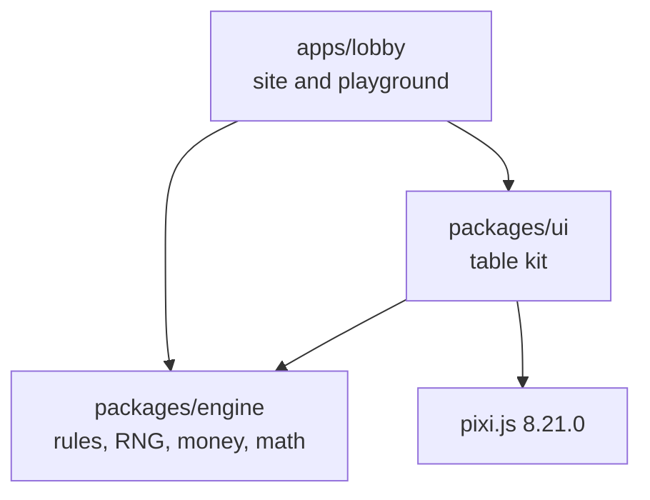
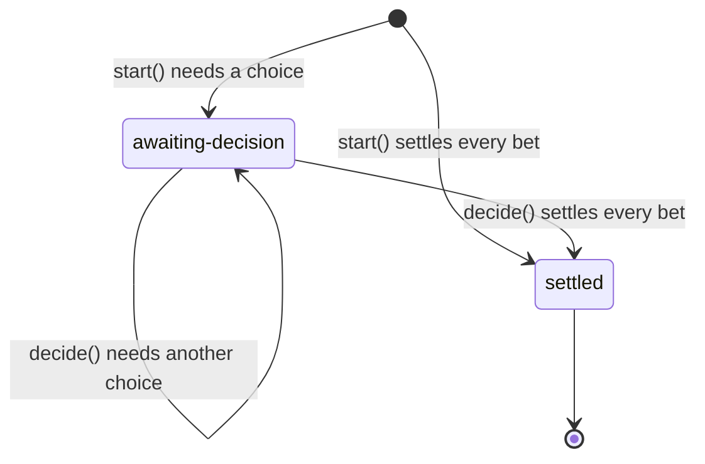
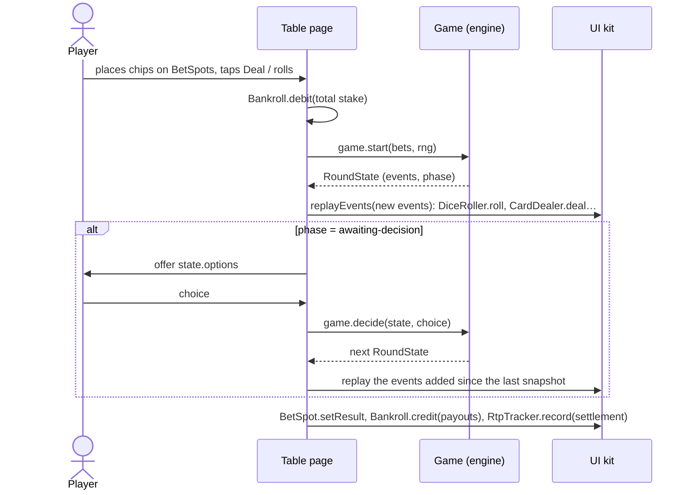

# Architecture

This document explains how the repository is put together and why. The [README](../README.md)
covers what the project is and how to run it. [MATH.md](MATH.md) covers how the numbers are
verified.

## Goals and constraints

- **Verifiable math first.** Every published RTP must be reproducible from code: exactly, where the
  game is enumerable, and by seeded simulation always.
- **Server-ready engine.** The browser demo has no backend, but the engine must run unmodified on
  a server where outcomes and money are authoritative.
- **Premium, mobile-first tables.** They must work from 360 px wide, in portrait and landscape, with
  touch, mouse, keyboard and screen readers, and honour reduced-motion preferences.
- **Few dependencies.** PixiJS (pinned) is the only runtime dependency, and it is confined to the
  dice and card animation layer. Everything else is DOM, CSS and TypeScript.

## Packages



| Package           | Role                                                                        | May import                           |
| :---------------- | :-------------------------------------------------------------------------- | :----------------------------------- |
| `packages/engine` | Decides outcomes and moves money: RNG, dice, shoe, rounds, settlement, math | Nothing: zero dependencies, no DOM   |
| `packages/ui`     | Table components (DOM + CSS) and the animation layer (PixiJS)               | engine, pixi.js (in `src/pixi` only) |
| `apps/lobby`      | The site: lobby, game routes, playground                                    | engine, ui                           |

The dependency rules are enforced by tooling, not left to convention:

| Rule                                      | Enforced by                                                                                            |
| :---------------------------------------- | :----------------------------------------------------------------------------------------------------- |
| No `Math.random` anywhere                 | ESLint `no-restricted-properties` (`repo/no-math-random`)                                              |
| Engine has no runtime dependencies        | `src/package.test.ts` fails if `dependencies` appears in its `package.json`                            |
| Engine uses no DOM or Node APIs           | Build compiles with `lib: ["ES2022"]`, `types: []`; ESLint bans browser globals (`repo/engine-purity`) |
| Engine never imports UI or rendering code | ESLint `no-restricted-imports` (`repo/engine-purity`)                                                  |
| PixiJS only in `packages/ui/src/pixi`     | ESLint `no-restricted-imports` (`repo/pixi-confinement`)                                               |
| Game sheets match the code                | `pnpm docs:check` in CI                                                                                |

Workspace packages export their TypeScript sources (`"exports": "./src/index.ts"`), so Vite,
Vitest and `tsc` consume the source directly and there is no build-before-test step. The engine
also has a real build (`tsc -p tsconfig.build.json` → `dist/`, with declarations and source maps)
because a server would consume it as plain JavaScript. `publishConfig` points the exports at
`dist/`.

## Engine

### Module map

| Module         | Contents                                                                                                       |
| :------------- | :------------------------------------------------------------------------------------------------------------- |
| `rng/`         | `Rng`, `IntegerRng`, `createSeededRng`, `createCryptoRng`, `randomInt`, `shuffleInPlace`                       |
| `dice/`        | `rollDie`, `rollDice`, `diceTotal`, `DieFace`, `DicePair`                                                      |
| `cards/`       | `Card`, `Rank`, `Suit`, `RANK_SETS`, card codes (`'TH'`), `CardSource`, `Shoe`                                 |
| `game/`        | `Game`, `RoundState`, `GameEvent`, `BetDefinition`; `RoundBuilder`; money; settlement; validation; `playRound` |
| `progressive/` | `ProgressiveJackpot`                                                                                           |
| `math/`        | `Fraction`, `enumerateOutcomes`, `exactReturns`, `simulate`, `roundsForTolerance`, sheet rendering             |
| `games/`       | The games (`entre-dados/`: pure rules, bet definitions, the game) and `GAMES`, their registry                  |
| `testing/`     | Scripted RNGs and card sources, chi-square tests (`@casinogames/engine/testing`)                               |
| `fixtures/`    | Two toy games that exercise the engine and its math tooling in tests                                           |

### Randomness

Everything is deterministic given the injected `Rng`:

```ts
interface Rng {
  next(): number; // uniform in [0, 1), at least 32 bits of randomness
}
interface IntegerRng extends Rng {
  nextInt(n: number): number; // optional capability: uniform integer in [0, n)
}
```

- `createSeededRng(seed)` implements **xoshiro128\*\* 1.1**, with its 128-bit state expanded from
  the seed by SplitMix64 as its authors recommend. Seeds may be numbers, bigints or strings (FNV-1a
  64 over UTF-8), so tests read like `createSeededRng('war-fixture/monte-carlo')`. The port is
  checked against vectors produced by the reference C implementation. It is used for tests,
  simulations, replays and cosmetic variation.
- `createCryptoRng()` wraps `crypto.getRandomValues` (browsers, Node ≥ 20), fetched in blocks. Real
  play uses it.
- `randomInt(rng, n)` scales to an integer by **rejection sampling** on 32 bits: values in the
  incomplete top bucket are redrawn, so each result has probability exactly 1/n. When the `Rng`
  implements `nextInt`, `randomInt` delegates to it. That is how the exact enumerator branches on
  every draw, and how a server can plug in an RNG service that does its own certified scaling.
- `shuffleInPlace` is Fisher–Yates (Durstenfeld), drawing from the last index down. **The draw
  order is part of the determinism contract**: the same stream always produces the same shoe.

Cosmetic randomness (the tumble axes of the 3D dice, pitch variations in the synthesised sounds)
also goes through seeded `Rng`s, in separate streams that never touch outcomes. That keeps the
`Math.random` ban absolute.

### Cards and the shoe

Games take cards through `CardSource`, not through `Shoe` directly:

```ts
interface CardSource {
  beginRound(rng: Rng): boolean; // reshuffles if due; true if it did
  draw(rng: Rng): Card;
  remaining(): number; // Infinity for an infinite shoe
  size(): number;
  shuffleCount(): number;
}
```

This seam lets tests script exact cards (`createScriptedCardSource('AS TH 5D')`), lets a server
serve a persisted shoe, and lets a live-dealer table serve a card reader.

`Shoe` behaves like a dealing shoe:

- It holds N decks of a configurable rank set (`RANK_SETS.aceToSix`, `aceToTen`, `aceToKing` or
  any list) in four suits.
- The **cut card** sits at `penetration` (default 0.75, meaning 25% of the cards remain). It never
  interrupts a round: once it is out, the round finishes and the next `beginRound()` reshuffles
  everything.
- If a round empties the shoe, only the discards from earlier rounds are shuffled into a new stack,
  never the cards in play, and a full reshuffle is forced before the next round. A round that needs
  more cards than the whole shoe throws `ShoeExhaustedError`.
- **Infinite mode** (`decks: Infinity`) draws each card independently and uniformly from one deck's
  composition, with exactly one RNG draw per card. Exact enumeration and Monte Carlo tests use it.

`RoundBuilder.dealCard` records a `shoe-shuffled` event whenever a draw triggers a mid-round
reshuffle, so the UI can play the shuffle animation at the right moment.

### Money and settlement

- **All money is integer cents** (`Cents`, a safe integer). Bets are `{ [betId]: cents }`.
- Odds use "to" notation: `odds(3, 2)` is "3 to 2". A winning stake returns the stake plus
  `floor(stake × to / per)`, and the fraction of a cent (breakage) stays with the house.
- A `SettlementLine` is `{ stake, payout, net, outcome, entryId? }`. `payout` is everything handed
  back, stake included: 0 on a loss, the stake on a push. The outcome is derived from `net`, so a
  surrender that returns half the stake is a loss. RTP is Σ payout ÷ Σ stake.

### Bets

A `BetDefinition` carries everything the UI, docs and simulations need: `id`, `label`, `kind`
(`main` or `side`), limits in cents, a paytable of fixed-odds, progressive or push entries (each
with an optional exact `probability`), the declared `rtp` and an optional `standardDeviation`. From
the paytable, `summarizeMath` derives each bet's hit frequency, push frequency and max exposure.

- `defineBets([...])` validates definitions **at module load** (unique ids, sane limits, plausible
  RTP, non-empty paytables), so a misconfigured paytable fails on import, in the first test run or
  at startup, rather than mid-round.
- `validateBets(definitions, bets)` runs at the start of every round. Every id must be known, stakes
  must be integer cents within limits, at least one bet must be placed, and side bets require a main
  bet. Zero stakes are dropped. Each failure is an `EngineError` with a stable code.

### Rounds

A game is a state machine over rounds:

```ts
interface Game<TChoice, TData, TEvent> {
  readonly id: string;
  readonly name: string;
  readonly bets: readonly BetDefinition[];
  start(bets: Bets, rng: Rng): RoundState<TChoice, TData, TEvent>;
  decide(
    state: RoundState<TChoice, TData, TEvent>,
    choice: TChoice,
  ): RoundState<TChoice, TData, TEvent>;
  mathSummary(): MathSummary;
}
```



A `RoundState` is an immutable snapshot:

| Field        | Meaning                                                                                |
| :----------- | :------------------------------------------------------------------------------------- |
| `phase`      | `'awaiting-decision'` or `'settled'`                                                   |
| `bets`       | Current stakes, including stakes added by decisions                                    |
| `events`     | The ordered event log since `round-started`                                            |
| `settlement` | Lines for the bets settled so far; complete once `phase` is `'settled'`                |
| `options`    | The choices `decide()` accepts (empty once settled), each with an optional added stake |
| `data`       | Game-private continuation state: hidden cards, kept dice…                              |
| `rng`        | The round's `Rng`, carried so `decide()` keeps drawing from the same stream            |

Games are written against `RoundBuilder`, obtained from `startRound(game, bets, rng)` or
`continueRound(state, choice)`. The builder owns the invariants, so no game can break them:

- Stakes are validated before anything is drawn. Every placed bet is settled **exactly once**, and
  `finish()` refuses to close a round with unsettled bets (`UNSETTLED_BETS`).
- Settling an unplaced bet, settling twice, or adding stake to a settled bet all throw.
- Choosing an option applies its `additionalStake` (a raise, a double) as a `stake-added` event.
- A closed step cannot be modified (`ROUND_CLOSED`). Each `decide()` returns a new snapshot, and
  earlier snapshots are never mutated.
- Lifecycle events (`round-started`, `decision-*`, `stake-added`, `bet-settled`, `round-settled`)
  can only be emitted by the builder. Games emit the rest (`dice-rolled`, `card-dealt`, their own
  custom events) through `emit()` or the `rollDice()` / `dealCard()` helpers.

### Event catalogue

| Event                | Payload                               | Emitted by                                          |
| :------------------- | :------------------------------------ | :-------------------------------------------------- |
| `round-started`      | `bets` (validated stakes)             | builder                                             |
| `shoe-shuffled`      | `cards` in the new stack              | `prepareCards`, `dealCard`                          |
| `dice-rolled`        | `dice: [d1, d2]`                      | `rollDice`                                          |
| `card-dealt`         | `card`, `to` (hand id), `faceUp`      | `dealCard`                                          |
| `card-revealed`      | `card`, `to`, `index` within the hand | `revealCard`                                        |
| `decision-requested` | `options`                             | builder (`awaitDecision`)                           |
| `decision-made`      | `choice`                              | builder (`continueRound`)                           |
| `stake-added`        | `betId`, `amount`                     | builder (`addStake`)                                |
| `jackpot-won`        | `jackpotId`, `betId`, `amount`        | game                                                |
| `bet-settled`        | `betId` and the settlement line       | builder (`win`, `lose`, `push`, `payout`, `settle`) |
| `round-settled`      | `totalStake`, `totalPayout`, `net`    | builder (`finish`)                                  |

Games may add custom events (a moving marker, a locked die) through the `TEvent` type parameter.
Their `type` must not clash with the core events.

`card-dealt` carries face-down cards, because the engine needs them to settle. When the engine runs
on a server, the client receives a projection with those cards blanked until the matching
`card-revealed` (see [Server-side](#server-side)).

### Tables and rounds

A `Game` object is created **per table** and may own table resources: a finite shoe that persists
across rounds, or a progressive pool. Rounds themselves are values. This split keeps the round
logic pure and makes the stateful parts explicit and replaceable. The exact enumerator creates a
fresh game for every branch so table state cannot leak between branches. The simulator reuses one
game for millions of rounds, so a leak between rounds would surface there.

### Progressive jackpots

`ProgressiveJackpot` is an in-memory pool with a seed amount, a contribution rate and an optional
cap. Contributions are tracked in millionths of a cent, so sub-cent amounts accumulate exactly
instead of being rounded away. An award pays a share of the pool in whole cents, and the house tops
the pool back up to its seed. The pool conserves money exactly: seed + contributions + top-ups =
awards + pool, and a test checks it. The long-run RTP of a progressive bet is derived in
[MATH.md](MATH.md#progressive-jackpots).

### Math tooling and game sheets

`exactReturns` (exhaustive enumeration with BigInt fractions) and `simulate` (Monte Carlo with
standard errors) both run the real game through `playRound`, so they test the implementation, not
a model of it. [MATH.md](MATH.md) describes both.

Every game's `mathSummary()` is derived from its bet definitions by `summarizeMath`. The paytable
modal renders it in the browser, and `pnpm docs:sheets` writes it into `docs/games/<id>.md` between
`<!-- math:start -->` and `<!-- math:end -->`: an overview table (RTP, house edge, hit frequency,
push, max exposure, volatility index, limits) and each bet's paytable. The section is fenced off
from Prettier, which would otherwise re-align its tables. The published figures therefore come from
the code the tests verify, and `pnpm docs:check` fails CI when a sheet is stale.

### A game: Entre Dados

`games/entre-dados` shows how a game is built on the engine:

- `rules.ts` is the rulebook as pure functions of a roll and a card value
  (`resolveEntreDadosBet`, `readEntreDadosRoll`). The game settles with them and the table reads
  the roll with them, so the rules exist once.
- `bets.ts` declares every bet with exact fractions: RTP, entry probabilities and σ.
- `game.ts` owns the table's six-deck shoe and plays a round: roll, deal face down, reveal, settle.
- The tests enumerate all 36 rolls × 6 card values exactly, simulate 124,852,059 rounds against
  the real shoe, and compute the card counting exposure exactly.

## UI kit

### Two layers

- **Chrome is DOM + CSS**: chips, bet spots, balance, toggles, modals, the RTP panel and autoplay.
  These parts need accessibility, text rendering, layout and focus management, which the DOM
  already does well.
- **Animation is PixiJS**, only for the 3D dice and the card table. Each is defined by a small view
  interface (`DiceView`, `CardView`) with two implementations: a PixiJS one, loaded with a dynamic
  `import()` the first time a table needs it, and a DOM/CSS fallback. If WebGL and Canvas both fail,
  or `renderer: 'dom'` is requested (tests, very old devices), the component quietly uses the
  fallback.
- Pixi hosts **render on demand**: the ticker does not run continuously. A frame is drawn only
  while an animation is in progress or after a resize, which keeps idle tables at zero GPU cost on
  phones.

Components never decide outcomes. `DiceRoller` reports how hard the player threw, and the table
then draws the result from the engine and hands it back to animate. `CardDealer` deals the cards
it is given. A face-down card is drawn as a back only, and its face is painted when it is revealed,
so a hidden card is never put on the page.

### Components

| Component               | Purpose                                                                                                                         |
| :---------------------- | :------------------------------------------------------------------------------------------------------------------------------ |
| `ChipRail`              | Chip selector (0.50 / 1 / 5 / 25 / 100): a radio group with roving focus that steps down when the balance cannot cover the chip |
| `BetSpot`               | Tap to add the selected chip, long-press (with a progress ring), right-click or Delete to clear; shows rejections and results   |
| `DiceRoller`            | Tap, or hold and release to throw harder; 3D tumble with bounces in Pixi, CSS dice as fallback                                  |
| `CardDealer`            | Deals from a shoe with slide and flip, shows the shoe counter and the cut card, announces cards to screen readers               |
| `BankrollDisplay`       | Balance with a count-up and a floating win or loss delta; offers a top-up below the table minimum                               |
| Paytable modal          | Built from `mathSummary()`: odds, probabilities, RTP, house edge, standard deviation, limits                                    |
| Info modal              | Renders a game sheet (Markdown) as the Rules dialog                                                                             |
| `RtpPanel`              | Rounds, wagered, returned, and live versus declared RTP per bet, with a convergence sparkline and its 95% band                  |
| `AutoPlay`              | Runs 10 to 100 rounds; stops on request, on error, or before a round the balance cannot cover                                   |
| Turbo and sound toggles | Switches that persist settings; turbo sets the motion level to `none`                                                           |

### Motion

One `Motion` policy serves the whole page, with three levels: `full`; `reduced` (the OS asks for
it, so large movements become short fades, capped at 160 ms); and `none` (turbo: results appear
instantly). Components ask the policy for durations instead of hard-coding them. CSS reads the same
policy through duration tokens that collapse to zero under `[data-motion='turbo']` and
`prefers-reduced-motion`.

### Sound

Every sound is synthesised with the Web Audio API: filtered noise for chips, dice and cards, and
short triangle-wave arpeggios for wins. No audio files are shipped. Browsers block audio until a
user gesture, so the `AudioContext` is created on the first gesture and never before. Calls made
before that are silent no-ops, which also keeps page load free of autoplay warnings.

### State and persistence

- A tiny `createStore(initial, equals)` provides subscribable state with no framework.
- `createSafeStorage()` wraps `localStorage` in try/catch (private mode, quotas, disabled storage)
  and falls back to memory. It validates everything it reads, because stored data is untrusted.
- Only three things persist, under the `casinogames:v1:` namespace: the **bankroll**, the
  **settings** (turbo, sound) and the **RTP stats** per game (`rtp:<gameId>`, saved on a 400 ms
  debounce). The convergence history is sampled at geometrically spaced round counts, so a million
  rounds of one bet take about 3 kB.

### Accessibility

- Tap targets are at least 44 px. Every control is reachable and operable from the keyboard.
- Components use native elements and standard ARIA roles: `<dialog>` for modals, `radiogroup` for
  the chip rail, `switch` for the toggles.
- Dealt cards, thrown dice and autoplay stops are announced through `aria-live` regions.
- The router moves focus to each new page's heading and updates the document title.
- Reduced motion is honoured everywhere (see [Motion](#motion)).

### Theme

Design tokens are CSS custom properties in `packages/ui/src/theme/tokens.css`: felt, brass, ink,
signal colours, chip and card colours, type, spacing, radii, shadows and durations. Pixi views read
their colours from the same tokens at runtime, so the canvas matches the chrome.

## Lobby app

- **Routing.** A small History API router with base-path support (`/CasinoGames/` on Pages)
  intercepts in-app links, moves focus, sets titles and loads pages lazily. Table pages and PixiJS
  load on demand: the lobby itself downloads about 25 kB of JavaScript and neither of them.
- **Routes.** `/` is the lobby and `/:slug` serves one of the four game slugs (anything else gets
  the not-found page). Games with rules load their table from the `tables/` registry; the others
  show a placeholder page. Each table opens its rules sheet from `docs/games/<slug>.md`, loaded
  through `import.meta.glob` so the docs are the single source.
- **Static hosting.** At build time a small Vite plugin copies `index.html` into each game's folder
  and to `404.html`, so deep links load directly on GitHub Pages.
- **Services.** `createServices()` builds the page-wide state once (storage, settings, bankroll,
  sound) and hands it to every page.
- **Playground.** `apps/lobby/dev.html` shows every component in isolation, including 3D dice,
  dealing from a real 6-deck engine shoe with the crypto RNG, and an RTP panel that can be fed up
  to 250,000 simulated rounds at a click.

## How a table plays a round

The Entre Dados table (`apps/lobby/src/tables/entre-dados`) follows this flow, and so will the
other tables.



## Server-side

The engine is ready to move behind an API unchanged. The client keeps the flow above and swaps the
local `game.start` / `game.decide` calls for requests. What the server adds (persistence without
the `rng`, wallet movements from the event log, redaction of face-down cards, persistent table
resources) is listed in the [README](../README.md#moving-the-engine-server-side).

## Testing strategy

| Layer        | What is tested                                                                                                                                                                           | How                                                   |
| :----------- | :--------------------------------------------------------------------------------------------------------------------------------------------------------------------------------------- | :---------------------------------------------------- |
| RNG          | Reference vectors (xoshiro128\*\* and SplitMix64), reproducibility, seed handling, uniformity of `randomInt`, shuffles and dice                                                          | Vitest; seeded chi-square tests, so they cannot flake |
| Shoe         | Composition, penetration and cut card, reshuffle rules, mid-round exhaustion, infinite mode                                                                                              | Vitest with seeded and scripted RNGs                  |
| Rounds       | Builder invariants, validation, error codes, settlement arithmetic, decisions and added stakes                                                                                           | Vitest with scripted dice and cards                   |
| Math tooling | Enumeration (including non-determinism detection), fractions, simulator statistics, sheet rendering                                                                                      | Vitest                                                |
| Game math    | Exact RTP, probabilities and variance equal the declared fractions; Monte Carlo within ±0.15 pp; card counting exposure                                                                  | `pnpm test` (exact), `pnpm test:math` (Monte Carlo)   |
| UI kit       | Components' DOM, keyboard and pointer behaviour, persistence, motion, audio gating, autoplay stops, RTP statistics                                                                       | Vitest in jsdom, with the DOM renderers               |
| Lobby        | Router: base paths, link interception, not-found handling, focus and titles; the Entre Dados table plays rounds that match the engine's settlement, including one interrupted by leaving | Vitest in jsdom                                       |
| Visuals      | Layout at 360 px, 390 px, landscape phones and desktop; the Pixi renderers                                                                                                               | Manual review in headless Chromium with screenshots   |

## Decisions

| Decision                                  | Why                                                                                                                                                                           |
| :---------------------------------------- | :---------------------------------------------------------------------------------------------------------------------------------------------------------------------------- |
| `RoundState` carries its `Rng`            | `decide(state, choice)` keeps its two-argument signature and still draws from the round's stream. A server strips it before persisting and re-attaches its own RNG on resume. |
| `CardSource` interface in front of `Shoe` | Scripted cards in tests, persisted shoes on a server, card readers at live tables, with no change to game code.                                                               |
| Optional `IntegerRng.nextInt`             | Lets the enumerator branch on each draw with probability exactly 1/n, and lets a certified RNG service own the scaling.                                                       |
| Rejection sampling for integers           | `floor(next() × n)` is biased for any n that is not a power of two, and certification labs flag it.                                                                           |
| xoshiro128\*\* seeded by SplitMix64       | Small, fast, well-studied (passes BigCrush), with a 32-bit output that JavaScript handles natively. SplitMix64 makes adjacent seeds produce unrelated streams.                |
| Exact math by enumerating the real code   | A separate combinatorial model can agree with itself and still disagree with the game. Enumerating the game's own draws tests what ships.                                     |
| Monte Carlo rounds sized from σ           | A fixed 2,000,000 rounds is too few for volatile bets. Sizing from the bet's standard deviation keeps a correct implementation's failure probability below 0.1%.              |
| Integer cents, floored breakage           | No floating-point drift between client, server and ledger; the rounding rule is explicit and conventional.                                                                    |
| Builder-owned lifecycle events            | Games cannot forget to settle a bet, settle twice or skip `round-settled`; every game gets the same audit log.                                                                |
| Paytables and sheets generated from code  | One source for declared figures; stale docs fail CI.                                                                                                                          |
| DOM chrome, Pixi only for dice and cards  | Accessibility and layout come free with the DOM. Pixi is used only where a canvas is actually needed, and it is loaded lazily with a DOM fallback.                            |
| Render-on-demand Pixi hosts               | Idle tables cost nothing on battery-powered phones.                                                                                                                           |
| Own Markdown renderer                     | The rules sheets need a small, safe subset (no raw HTML, vetted links). Writing it avoided a runtime dependency; the project takes none beyond PixiJS without approval.       |
| Native `<dialog>` for modals              | Focus trapping, Escape handling and top-layer stacking come from the browser.                                                                                                 |
| TypeScript 6.0, Vitest 4, jsdom 29        | Vitest 5 and jsdom 30 need Node 22, but the project supports Node 20. `typescript-eslint` supports TypeScript up to 6.0.                                                      |
